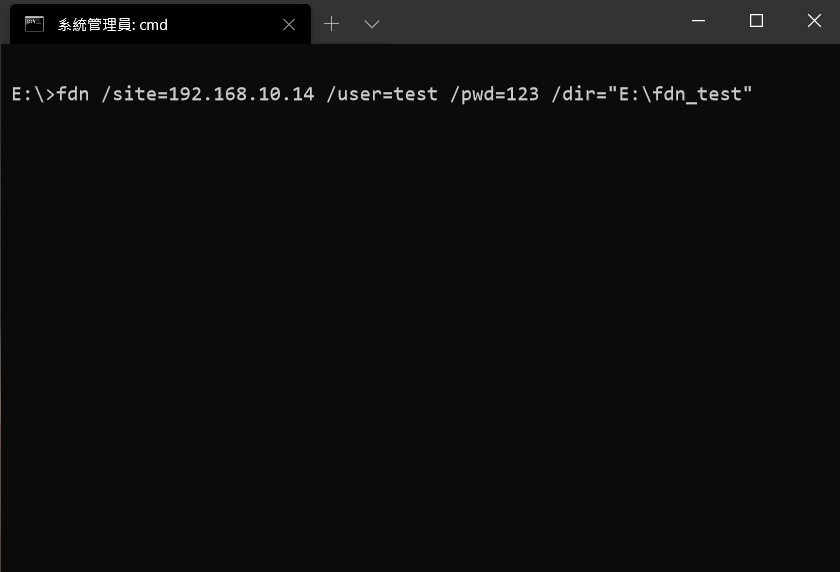

## 說明

此工具為 FTP 的專用下載器，透過命令列方式來操作，目前暫不支援 SFTP 與其他協定

`fdn /Site /User /Pwd /Dir [/AutoClose]`

- `/Site`
  - FTP 站點名稱
  - 如：  `/Site=192.168.1.1`
- `/User`
  - FTP 登入的使用者帳號
  - 如：  `/User=myAccount`
- `/Pwd`
  - 登入的使用者密碼
  - 如：  `/Pwd=123`
- `/Dir`
  - 下載的目的地、本機資料夾路徑
  - 如：  `/Dir=D:\myFold` 或 `/Dir="C:\Program Files (x86)\myFold"`
- `/AutoClose` (非必要參數)
  - 下載完畢後是否要自動關閉視窗
  - 如：  `/AutoClose=true` 或 `/AutoClose=false`

## Description

This tool is a simple FTP downloader that use command-line to operate. SFTP is not supports.

`fdn /Site /User /Pwd /Dir [/AutoClose]`

- `/Site`
  - FTP host name
  - E.g.  `/Site=192.168.1.1`
- `/User`
  - Account to login
  - E.g.  `/User=myAccount`
- `/Pwd`
  - Password of account
  - E.g.  `/Pwd=123`
- `/Dir`
  - The local folder to store downloaded files
  - E.g.  `/Dir=D:\myFold` or `/Dir="C:\Program Files (x86)\myFold"`
- `/AutoClose` (Optional)
  - Close window automatically after download finished. true or false.
  - E.g.  `/AutoClose=true` or `/AutoClose=false`

## 示範 / Demo

